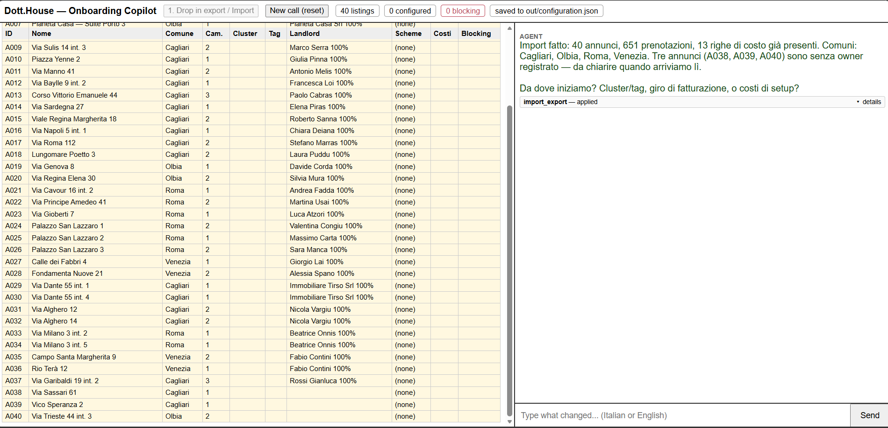
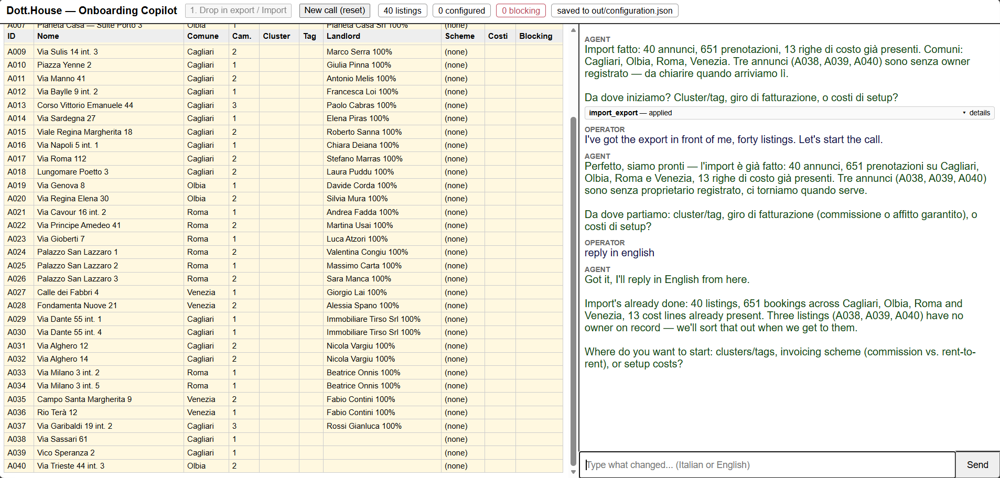
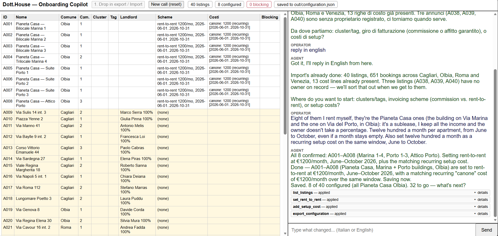
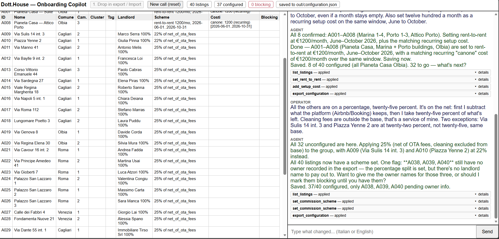
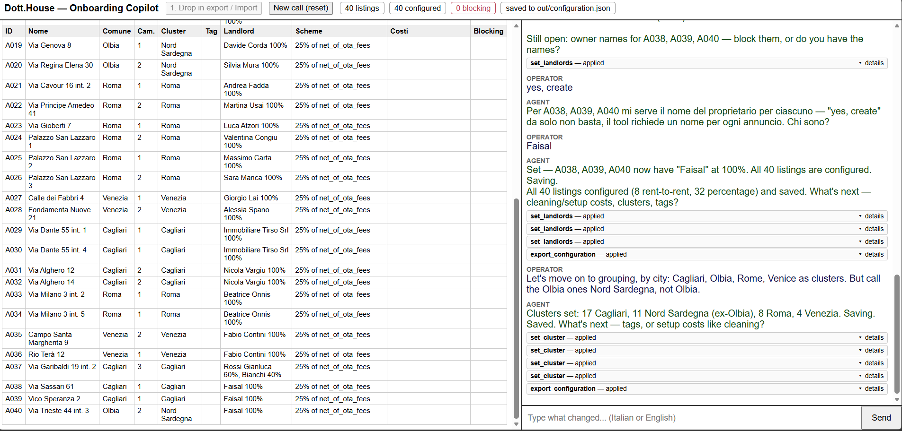
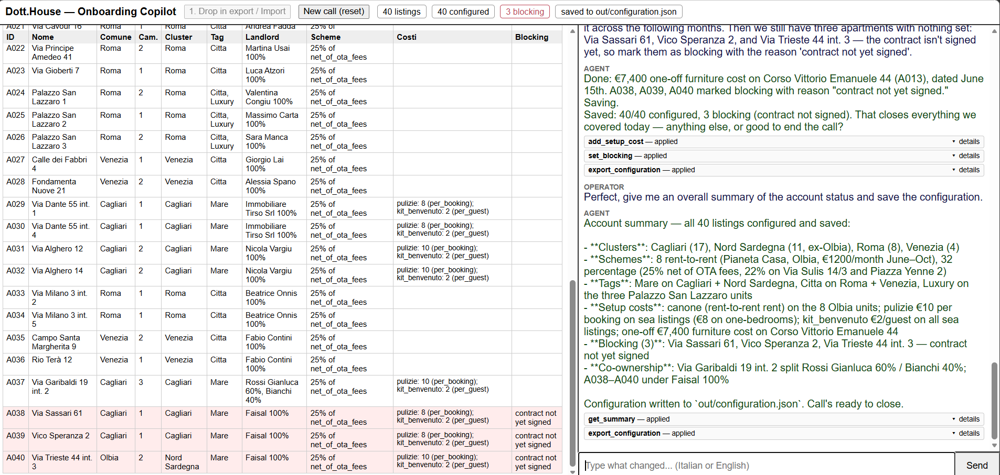

# Dott.House Onboarding Copilot

A chat tool an operator uses live, on a call with a new customer, to set up
their account: import the property-management export, group the listings
into clusters and tags, decide how each one gets billed (a commission
percentage or a fixed rent-to-rent deal), record co-ownership splits and
one-off setup costs, and save the result to `out/configuration.json`. Built
for the take-home slice described in the brief: import, grouping, landlord
terms, setup costs. See `PRIORITIES.md` for what's deliberately left out
and why, and `transcripts/` for how this was built.



The left pane is the account, live every listing, and how it's
currently configured. The right pane is the conversation. Every agent
reply that changed something shows the actual tool call it made, in a
box you can click open to see exactly what was read or written.

## How to run it

From a clean checkout, in this order:

```bash
uv sync                    # installs mcp, claude-agent-sdk, flask
uv run python -m eval.run  # ~1s, no LLM calls -- sanity-checks the domain
                            # logic before you trust anything built on it
uv run python -m ui.main   # starts the app on http://localhost:8000
```

Open `http://localhost:8000` and click **"1. Drop in export / Import"** —
that's the "operator drops the export file in" moment from the brief. It
loads the three CSVs in `data/` and starts the call. From there just type
what changed, in Italian or English, into the box on the right.

## Walking through a real call

These screenshots are from an actual run against the live agent as given below:

**1. Import.** Click the button, the agent calls `import_export`, and the
left pane fills in with all 40 listings, nothing configured yet, cluster
and tags empty, exactly as the brief describes a fresh export.



**2. The "otto volte" moment.** The operator says the eight Pianeta Casa
listings are a sublease at a fixed monthly rent. One message, one selector
`set_rent_to_rent` plus a matching recurring `add_setup_cost`, both
scoped to "owner: Pianeta Casa" and all eight update together instead of
one at a time.



**3. The rest, on a percentage and a clarifying question.** "Twenty-five
percent" isn't enough on its own (see "The base-of-a-percentage rule"
below), so the operator has to say what it's a percentage *of*. The agent
applies 25% net-of-OTA-fees to everyone left, narrows two listings to 22%,
and then on its own notices three listings still have no owner
recorded and asks what to do about them instead of guessing.



**4. Either answer works.** Told to just create a landlord for those
three, the agent asks for an actual name (it won't accept "yes, create" as
a name), gets "Faisal", and finishes all 40 as configured with no blocking
listings at all:



Told instead to mark them blocking, that works too 40 configured, 3 of
them explicitly blocking with a reason, which is the ending that matches
the original call transcript in `data/onboarding_call.md`:



Both are legitimate ways to close out three listings with missing
information the point of the tool is that it never leaves them silently
unconfigured, and never guesses an owner or a commission base on your
behalf.

## The tool surface

**Every tool that changes listings takes a selector, not a single ID.** A
selector is either an explicit list of IDs, or a filter cluster, tags,
comune, room count, owner, current scheme, blocking status that all
combine together. This exists because of one moment in the source
transcript: the operator configures eight identical listings one at a
time, narrating "Marina 1... Marina 2... Marina 3...", and the client
interrupts to ask if they really have to do this eight times. A selector
means "all the sea-facing listings" or "everything under Pianeta Casa" is
one call instead of eight, and the same selector previews a change
(`dry_run=true`) before it's applied for real.

**The base-of-a-percentage rule.** `set_commission_scheme`'s `base`
argument has no default and is required on every call. "Twenty-five
percent" isn't a number until you say twenty-five percent *of what* net
of the booking platform's own fee, or the guest's full payment before that
fee comes out and that choice moves real money across a whole
portfolio. The tool simply cannot be called without naming it, and the
agent's instructions tell it to ask rather than ever guess.

| Tool | What it's for |
|---|---|
| `import_export` | Loads the three CSVs from `data/` and starts a fresh account. Takes no arguments, the brief is explicit that `data/` is fixed. |
| `get_summary` | Portfolio-wide progress: totals, configured vs. blocking, breakdowns by cluster and scheme. |
| `list_listings` | A compact view of listings matching a selector (or all 40), the "what would this affect" preview before any bulk change. |
| `get_listing` | Full detail on one listing, including every setup cost. |
| `set_cluster` | Assigns a cluster (usually geography) to every matched listing. Renaming is just re-running this with a selector matching the old name. |
| `set_tags` | Adds, removes, or replaces tags (typology/market segment) on matched listings. |
| `set_commission_scheme` | Percentage commission, with a required `base` see above. |
| `set_rent_to_rent` | A fixed monthly rent for a season instead of a percentage. Doesn't also create the matching cost line that's a separate `add_setup_cost` call, since the scheme and the cost it implies are different facts that can diverge. |
| `set_landlords` | Co-ownership split for **one** listing. Not selector-based on purpose an ownership split is a fact about one specific property, never a policy you'd bulk-apply. |
| `set_blocking` | Marks listings as blocking (excluded from P&L until resolved), with a required reason. |
| `add_setup_cost` | Records a setup cost (recurring, one-off, per-booking, or per-guest). Upserts by `(listing, label)`, so a correction like "actually the two-bedrooms are cheaper" is just another call with a narrower selector and the same label, it overwrites only the listings that match. |
| `remove_setup_cost` | Deletes a cost outright different intent from a correction, so it's a separate tool rather than `amount=0`. |
| `export_configuration` | Writes `out/configuration.json`. Safe to call every turn; the agent is told to call it after every change and always at the end. |

## What was assumed, and what's worth confirming with a real client

- **`Camere` = bedroom count**, so "a one-bedroom" (`bilocale`) means
  `camere == 1`. Worth confirming this holds for a PMS export from a
  different vendor.
- **Setup costs are always in EUR**, and always one of the four shapes
  above no per-night shape came up in the source data.
- **A blocking listing still accrues setup costs** while it's blocked (the
  cost exists whether or not revenue is currently attributed to it). This
  is a modeling choice, not something a client actually confirmed.
- **The tool will never let the agent set a commission scheme without a
  named base.** This isn't really an assumption it's the one thing in
  this domain the software refuses to guess at, on purpose.

## What's deliberately not here

No P&L or payout calculation (the brief's scope is import, grouping,
landlord terms, and setup costs getting the *configuration* right is the
prerequisite for a payout number ever being trustworthy, and that's
already the full time budget on its own). No undo/edit-history stack
(a misspoken instruction is just corrected with the next message, the way
it actually happens on a live call). No persistence beyond the JSON
export (state lives in the server process for the call; re-import to
resume). No voice input, no dedicated translate tool (the agent is
already fluent in Italian and English and just matches whichever the
operator uses), no auth or multi-operator support (one call, one
process), and no hardening against arbitrary malformed CSVs (the brief
says parsing isn't scored). Full reasoning for each of these is in
`PRIORITIES.md`.

## Testing

`uv run python -m eval.run` runs five checks directly against the domain
model — no server, no agent, no LLM calls, under a second. They pin down
the parts of this domain that are easy to get subtly wrong: that an
owner-based selector still works after a scheme change clears the raw
`landlords` list, that an invalid commission base is rejected rather than
silently accepted, and that a setup-cost correction narrows the right
subset without duplicating the cost line.

`uv run python -m scripts.test_conversation` is the other end of the
pyramid: a scripted, ten-turn conversation — the same one narrated above
with screenshots run against the real agent and the real Claude Agent
SDK, no mocks. It prints every reply and tool call as it happens and
checks the final state against the source transcript's own numbers (40
listings, 8 rent-to-rent, 29 percentage, 3 blocking). This costs a few
dollars and takes under two minutes to run, since it's a live model
making real tool calls, not a fixture replay.

## Cost

Model: **claude-sonnet-5**, via the Claude Agent SDK. A full onboarding
all 40 listings, replaying the whole source transcript's content takes
**10 operator turns** (the brief's own budget) and costs roughly **$2.80–
$3.10** end to end, 85–95 seconds of agent time, based on several live
runs while building and testing this. Cost per turn varies with how much
it touches a single-listing correction is cheap, a bulk commission-scheme
call with its own preview costs more.
